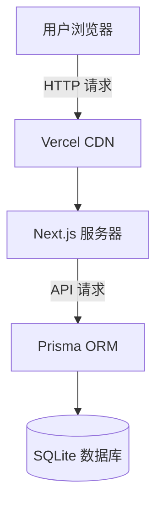

<!--
  本节最后更新：2026-05-13
  验证环境：无（方法章节，不依赖特定工具版本）
-->

## 15.5 读懂 AI 输出的架构图与配置

### 配置文件是最"无脑"但最"容易错"的部分

AI 生成代码时经常会附带配置文件——`package.json`、`tsconfig.json`、`next.config.js`、`docker-compose.yml`、各种 `.json`、`.yaml`、`.toml` 文件。

这些文件"看起来"很复杂——缩进、冒号、括号、嵌套结构。每个文件有自己的格式规范，一个缩进错误就可能导致整个项目无法运行。

好消息是：**你不必手动修改它们，但你需要知道它们是什么。** 就像你不需要知道汽车发动机的每个零件叫什么，但你需要知道"仪表盘上那个红色的灯亮了说明发动机有问题"。

**遇到配置文件问题的标准处理流程：**

1. 看到配置文件相关的错误（通常是启动项目时报的）
2. 把错误信息复制给 AI
3. AI 检查配置文件并修复

你不需要自己理解配置文件的内容。你只需要知道"项目启动时报错了 → 把错误信息给 AI"这个流程。

### JSON：最常见的配置格式

JSON（JavaScript Object Notation）是最常见的配置文件格式。

结构很简单：

```json
{
  "name": "my-app",
  "version": "1.0.0",
  "dependencies": {
    "next": "^14.0.0",
    "react": "^18.0.0"
  }
}
```

规则只有三条：

- `{}` 表示对象（一组键值对的集合）
- `[]` 表示数组（一组值的列表）
- 键和字符串值用双引号包裹（注意是双引号，不是单引号）

最常见的错误：**多了一个逗号或漏了一个逗号**。

```
// ❌ 错误：最后一个属性后面多了逗号
{
  "name": "my-app",   ← 错误！
}

// ✅ 正确
{
  "name": "my-app"
}
```

AI 生成的 JSON 通常不会出错。但如果你手动编辑时不小心加了一个多余逗号，AI 会帮你修复。

**关于 JSON 的一个实用认知：** JSON 不支持注释（`//` 或 `/* */`）。如果你在 JSON 文件中看到 `//`，那一定是错误。AI 知道这个规则。如果需要注释，使用 JSONC 格式（VS Code 等编辑器支持）。

**package.json 详解：**

`package.json` 是 Node.js 项目中最重要的配置文件。你不需要理解每一行，但知道几个关键字段就够了：

| 字段 | 作用 | 如果没设对会怎样 |
|------|------|-----------------|
| `scripts` | 定义可执行的命令（`npm run dev`、`npm run build`） | 无法运行项目 |
| `dependencies` | 生产环境依赖 | 部署后缺少依赖会报错 |
| `devDependencies` | 开发环境依赖（测试工具、构建工具等） | 本地开发可能缺少工具 |

> **一个包 "丢了" 怎么办？**
>
> 如果启动时报错 "Cannot find module 'xxx'"，通常是某个依赖没有安装。解决方法：
> 1. 运行 `npm install`（重新安装所有依赖）
> 2. 如果还是报错，告诉 AI "缺少 xxx 模块，帮我安装"

### YAML：配置即代码

YAML 是另一个流行的配置格式——和 JSON 相比，它"看着像人写的"：

```yaml
# docker-compose.yml
version: '3'
services:
  web:
    image: my-app:latest
    ports:
      - "3000:3000"
  database:
    image: postgres:16
    environment:
      POSTGRES_DB: myapp
```

YAML 的特点：

- 用**缩进**表示层级（2 个空格，不可以用 Tab）
- `#` 开头是注释
- `键: 值` 表示键值对

**YAML 最坑的地方：** 缩进敏感。如果缩进不一致，YAML 解析器会报错。而 YAML 的错误信息通常很难看懂。遇到这种情况，把 YAML 文件交给 AI：

> "这个 YAML 文件解析报错了，帮我检查缩进和格式。"

**在 Vibe Coding 中遇到 YAML 的常见场景：**

- Docker Compose 配置（`docker-compose.yml`）
- GitHub Actions 工作流（`.github/workflows/*.yml`）
- Vercel / Netlify 配置（`vercel.json`、`netlify.toml`——这些实际上是 JSON/TOML）

AI 生成的 YAML 配置通常不会出错。但如果你手动复制或修改了 YAML 文件，缩进很容易在复制粘贴时被破坏。保存时注意不要混合使用空格和 Tab。

### TOML：另一种配置格式

TOML 在 Rust 生态中很常见（如 `Cargo.toml`）：

```toml
[package]
name = "my-app"
version = "0.1.0"

[dependencies]
serde = "1.0"
```

TOML 比 YAML 简单得多——没有缩进敏感的问题，通过 `[section]` 区分段落。在 Vibe Coding 中遇到 TOML 的场景主要是 Rust 项目（Tauri）和 Python 项目（pyproject.toml）。

### 阅读 AI 生成的配置

当 AI 创建一个配置文件（如 `tsconfig.json`）时，你不需要理解每一行的含义。但你应该知道几个最重要的字段的含义：

**tsconfig.json（TypeScript 配置文件）：**

| 字段 | 作用 | 常见问题 |
|------|------|---------|
| `compilerOptions.target` | 编译目标版本（如 ES2020） | 太老的版本不支持新语法 |
| `compilerOptions.module` | 模块系统（如 commonjs、esnext） | 不匹配会导致导入报错 |
| `compilerOptions.paths` | 路径别名（如 `@/` 指向 `src/`） | 路径别名配置错误会导致找不到模块 |
| `include` | 哪些文件需要编译 | 漏了某些目录会导致类型不检查 |
| `strict` | 是否启用严格类型检查 | 关闭了可能错过类型错误 |

**next.config.js（Next.js 配置文件）：**

| 字段 | 作用 |
|------|------|
| `images.domains` | 允许加载外部图片的域名列表 |
| `redirects` | URL 重定向规则 |
| `output` | 输出模式（'standalone' 用于 Docker 部署） |
| `env` | 在构建时可用的环境变量 |

### 配置文件的三大常见错误

**错误 1：语法错误。**

症状：启动项目时报错 "Unexpected token" 或 "Parse error"。
原因：多了一个逗号、少了一个括号、混用了引号类型。
修复：把错误信息给 AI。

**错误 2：路径错误。**

症状：找不到模块或文件。
原因：配置中的路径和实际文件路径不匹配。
修复：告诉 AI "配置文件中的路径指向的位置不存在"。

**错误 3：版本不兼容。**

症状：安装依赖时报版本冲突。
原因：两个依赖要求的版本不兼容。
修复：告诉 AI "这两个包的版本冲突了，帮我解决"。

### 看懂 AI 画出的架构图（文字描述）

AI 不能直接给你画图（除非你让它生成 Mermaid 或 ASCII 图），但 AI 经常用文字描述架构。例如：

```
用户请求
  │
  ▼
Next.js 服务器 ──API Routes──→ 数据库
  │
  ▼ (静态资源)
CDN（Vercel Edge Network）
```

这个图告诉你三层架构：

1. **用户** → 浏览器发送请求
2. **Next.js 服务器** → 处理请求，要么返回页面（SSR），要么调用 API 返回数据
3. **数据库** → 存储持久化数据

如果你不习惯看文字描述，可以告诉 AI：

> "帮我用 Mermaid 语言画出这个项目的架构图。" 或者 "帮我画成 ASCII 图。"

AI 会输出类似这样的 Mermaid 代码，在支持 Mermaid 的 Markdown 预览中可以看到真正的图表：



**Mermaid 入门（一句话版）：**

告诉 AI "用 Mermaid 画这个架构图"，AI 自动处理。你不需要学 Mermaid 语法。

**读懂架构图的关键：** 找到"数据流向"——箭头指向的方向就是数据移动的方向。用户 → 服务器 → 数据库，这是最常见的流向。

### 遇到不懂的配置怎么办

遇到不认识的配置文件或配置项，不要自己瞎猜——直接问 AI：

> "这个 `tsconfig.json` 里 `compilerOptions` 的 `paths` 是做什么的？"

> "这个 `.env.example` 文件里的每个环境变量是什么意思？"

> "Dockerfile 中的 `RUN` 和 `CMD` 有什么区别？"

每个问题 AI 都会用一句话给你讲清楚。比你自己搜文档快得多。

**一个实用的"提问模板"：**

```
我在 [文件名] 中看到了 [配置项]，不太理解它的作用。
这个配置项是做什么的？如果我改错了会有什么后果？
```

例如：

> "我在 package.json 中看到了 `type: "module"`，不太理解它的作用。这个配置项是做什么的？如果我改错了会有什么后果？"

AI 会解释：这表示项目使用 ES Module（`import/export`）而不是 CommonJS（`require/module.exports`）。如果改错了，项目启动时会报 "Cannot use import statement outside a module"。

---

### 本节要点

- JSON 用 `{}` 和 `[]` 组织数据，YAML 用缩进组织层级，TOML 用 `[section]` 区分段落。你不必手动修改它们，但需要知道它们是什么。
- JSON 最常见的错误是多余逗号；YAML 最常见的错误是缩进不对。遇到配置文件错误，把错误信息给 AI 就行。
- package.json 的三个关键字段：scripts（命令）、dependencies（生产依赖）、devDependencies（开发依赖）。
- 配置错误三大类：语法错误（多逗号少括号）、路径错误（指向不存在的目录）、版本不兼容（依赖冲突）。
- 看不懂的配置直接问 AI——比自己搜文档更快。提问模板："[文件名] 中的 [配置项] 是做什么的？改错了会怎样？"
- AI 的文字架构图可以翻译成 Mermaid 图，在 Markdown 预览中看到可视化结果。找"箭头方向"即数据流向。

---

### Vibe 练习

对 Claude Code 说：

> "帮我解释这个项目中的每个配置文件的作用：package.json、tsconfig.json、next.config.js、.env.local。用一句话说明每个文件的用途和最常见的配置错误。"

进阶练习：

> 让 AI "用 Mermaid 语言画出当前项目的完整架构图：包含前端、后端 API、数据库、部署平台。帮我解释图中的每个组件和数据流向。" 然后在支持 Mermaid 的 Markdown 预览中查看可视化结果。